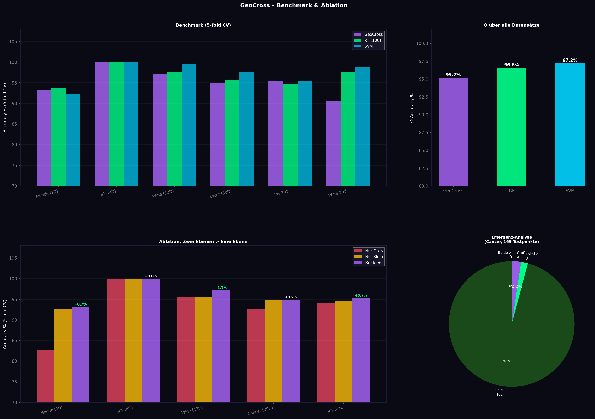
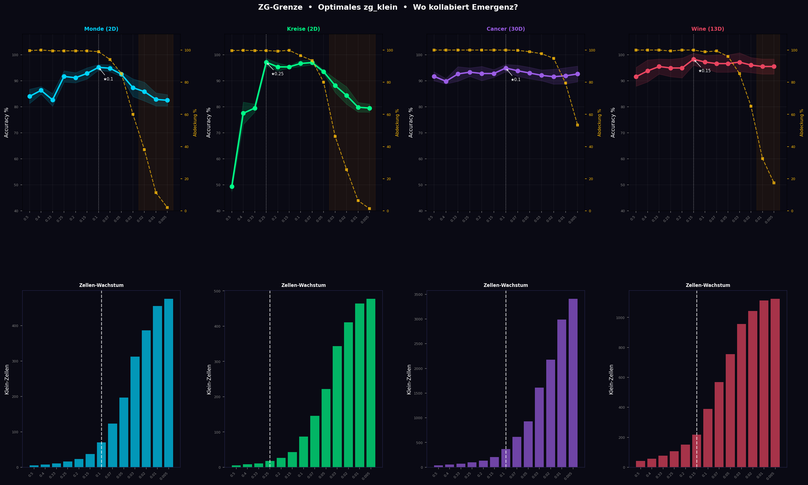

# GeoCross

Ein geometrischer Klassifikator. Kein Gradient. Keine Matrix-Multiplikation. Nur Würfel und Voting.

---

## Was es macht

GeoCross teilt den Merkmalsraum in Würfelzellen auf und merkt sich, welche Klasse in welcher Zelle dominiert. Bei einer neuen Vorhersage wird nachgeschaut, in welcher Zelle der Punkt landet.

Zwei Ebenen übereinander:
- **Großer Würfel** (grob, global): lernt die grobe Struktur
- **Kleiner Würfel** (fein, lokal): korrigiert an den Grenzen

Regel: wenn der kleine Würfel eine Antwort hat, gewinnt er. Sonst übernimmt der große. Wo beide sich widersprechen, entstehen automatisch Grenzzonen – niemand hat das programmiert.

---

## Warum zwei Ebenen?

Gemessen durch Ablation:

```
Nur großer Würfel:   90.4% Ø Accuracy
Nur kleiner Würfel:  92.4% Ø Accuracy
Beide zusammen:      92.7% Ø Accuracy  ← besser als jeder einzeln
```



---

## Zahlen (5-fold Stratified CV)

| Dataset        | Dims | GeoCross     | Random Forest (100 Bäume) | Δ     |
|----------------|------|--------------|---------------------------|-------|
| Iris (3 Kl.)   | 4    | 95.3 ±3.4%   | 94.7%                     | +0.7% |
| Cancer (binär) | 30   | 94.9 ±1.4%   | 95.6%                     | -0.7% |
| Monde (2D)     | 2    | 95.2 ±1.1%   | 94.7%                     | +0.5% |
| Wine (3 Kl.)   | 13   | 90.5 ±5.7%   | 97.7%                     | -7.3% |

GeoCross ist nicht immer besser als Random Forest. Der Unterschied liegt woanders:

| Eigenschaft        | GeoCross        | Random Forest  |
|--------------------|-----------------|----------------|
| Prediction-Speed   | ~9 µs           | ~4500 µs       |
| Modellgröße        | 54 KB           | ~300 KB        |
| Erklärbar          | ja              | nein           |
| Abhängigkeiten     | nur numpy       | sklearn        |
| FPGA-portierbar    | ja              | nein           |

---

## Installation

```bash
pip install numpy
```

Keine weiteren Abhängigkeiten.

---

## Schnellstart

```python
from sklearn.preprocessing import MinMaxScaler
from geocross import GeoCross

# Daten auf [0, 1] normieren – wichtig!
sc = MinMaxScaler()
X_train = sc.fit_transform(X_train_raw)
X_test  = sc.transform(X_test_raw)

# Trainieren
model = GeoCross(top_k=8)
model.fit(X_train, y_train)

# Vorhersagen
predictions = model.predict(X_test)
accuracy    = model.score(X_test, y_test)

# Erklärung für einen einzelnen Punkt
print(model.explain(X_test[0]))

# Speichern und Laden
model.save("model.json")
model2 = GeoCross.load("model.json")
```

---

## Parameter

| Parameter   | Default | Bedeutung                                          |
|-------------|---------|---------------------------------------------------|
| `top_k`     | 8       | Anzahl der besten Dimensions-Paare (Fisher-Score)  |
| `zg_gross`  | 0.33    | Zellgröße großer Würfel                            |
| `zg_klein`  | 0.10    | Zellgröße kleiner Würfel                           |
| `epochen`   | 5       | Trainings-Durchläufe                               |
| `auto_tune` | False   | Findet optimales zg_klein automatisch via 3-fold CV|

### auto_tune

```python
model = GeoCross(top_k=8, auto_tune=True)
model.fit(X_train, y_train)
print(f"Gefundenes zg_klein: {model.zg_k}")
# Testet intern: [0.25, 0.20, 0.15, 0.10, 0.07, 0.05]
```

Hinweis: instabil bei weniger als ~200 Trainings-Punkten. In diesem Fall lieber `zg_grenze.py` manuell ausführen.



---

## Erklärbarkeit

```
Vorhersage: Label 0
Stimmen:    Label 0: 6x  Label 1: 2x

Stärkste geometrische Begründung:
  (worst perimeter × worst concave points)  Fisher=3.239
    Ebene:      LOKAL  (klein zg=0.1)
    Sicherheit: 100%  (65 Punkte in dieser Zelle)
    worst perimeter: 0.494
    worst concave points: 0.675
    → Label 0
```

Jede Erklärung nennt:
- Welche zwei Dimensionen entscheidend waren (Fisher-Score)
- Ob die Entscheidung aus dem lokalen oder globalen Würfel kam
- Wie viele Trainings-Punkte diese Zelle gesehen hat
- Die konkreten Merkmalswerte des Punktes

---

## Wie es intern funktioniert

**Fisher-Score wählt Dimensions-Paare**

GeoCross betrachtet nicht alle Dimensionen gleichzeitig, sondern wählt die `top_k` besten Paare nach ihrer Trennschärfe zwischen den Klassen.

**Zwei Würfel pro Paar**

Jedes Paar bekommt einen groben und einen feinen Würfel. Grob = größere Zellen, mehr Punkte pro Zelle, stabiler. Fein = kleinere Zellen, präziser an Grenzen.

**Voting**

Jedes Dimensions-Paar gibt eine Stimme ab. Die Mehrheit gewinnt. Mehrklassen funktionieren nativ – kein One-vs-Rest.

**Grenzzonen**

Wo klein und groß sich widersprechen, entsteht eine Grenzzone. Das ist messbar:

```
Beide einig:     162x  → stabile Regionen
Konflikt:          7x  → Grenzzonen
Lokal richtig:    3/7
Global richtig:   4/7
```

---

## Edge-Computing / FPGA

Die Vorhersage reduziert sich auf Integer-Divisionen und Lookups:

```c
// Pseudocode – kein Float, keine Multiplikation nötig
key_k = (int)(x / 0.1) * 1000 + (int)(y / 0.1);
key_g = (int)(x / 0.33) * 100 + (int)(y / 0.33);

if (lookup(table_klein, key_k, &label)) return label;
if (lookup(table_gross, key_g, &label)) return label;
return default_label;
```

Auf FPGA:
- Division durch Konstante → Bit-Shift (0 ns Latenz)
- Lookup → BRAM-Zugriff (1 Clock-Cycle)
- Beide Ebenen können parallel laufen
- Konflikte (Groß ≠ Klein) direkt per XOR-Gatter messbar

---

## Einschränkungen

- Eingabedaten müssen auf [0, 1] normiert sein
- Nicht optimal bei sehr vielen irrelevanten Features
- Wine 3-Kl. ist -7.3% gegenüber RF – bei manchen Datensätzen ist RF besser
- auto_tune instabil bei kleinen Trainingsmengen
- Keine probabilistischen Vorhersagen

---

## Dateien

```
geocross.py   Hauptmodell – eine Datei, nur numpy
example.py    Verwendungsbeispiele
bench.py      Benchmark + Ablation + Emergenz-Analyse
zg_grenze.py  Zellgröße-Analyse: optimales zg_klein finden
export_c.py   Exportiert Modell als C-Header für FPGA/Mikrocontroller
```

---

## FPGA / Mikrocontroller

```python
from geocross import GeoCross
from export_c import export_c_header

# FPGA-optimale zg-Werte: Zweierpotenzen → Bit-Shift statt Division
# zg_gross = 0.25  →  x >> 2  (0 ns Latenz auf FPGA)
# zg_klein = 0.125 →  x >> 3  (0 ns Latenz auf FPGA)
model = GeoCross(top_k=8, zg_gross=0.25, zg_klein=0.125)
model.fit(X_train, y_train)
export_c_header(model, "geocross_lut.h")
```

Generiert einen C-Header mit statischen Arrays und einer fertigen `geocross_predict()` Funktion:

```
Groß-LUT:   200 Bytes  (5×5 × 8 Paare)
Klein-LUT:  648 Bytes  (9×9 × 8 Paare)
Gesamt:     848 Bytes

Tang 138K BRAM: ~1.1 MB verfügbar → 0.074% belegt
```

Das Array `GC_LUT_KLEIN` kann per `$readmemh` direkt in Verilog-BRAM-Module geladen werden.

---

## Lizenz

MIT
